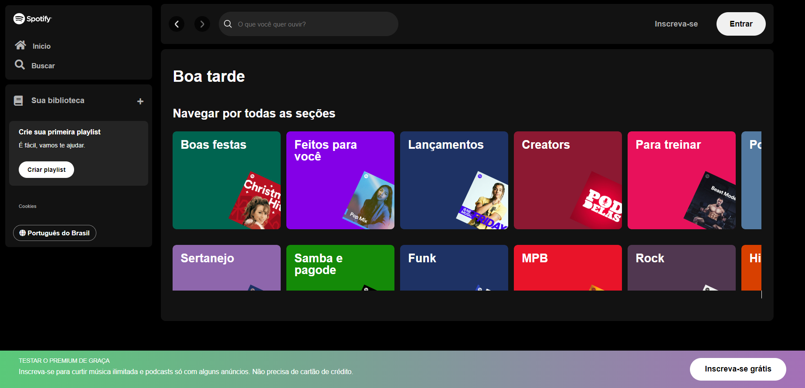

  <i class="fa-brands fa-spotify"></i>
  <ul align="left">
    
<h1 style="display: inline-block" color= >Spotify Landing Page</h1>

Esse projeto foi desenvolvido durante a Imersão Front-end oferecida pela Alura. O objetivo proposto era recriar a landing page (interface) da plataforma de streaming de música Spotify.

<h3 align="left">Linguagens Utilizadas:</h3>

* HTML;
* CSS;
* JavaScript.

<h3 align="left">Como Executar o Projeto?</h3>

1. Faça um clone deste repositório;
2. Baixe o Node.js;
3. Faça a implementação do API JSON-Server com uma porta 3000;
4. Baixe o Live Server;
5. E por fim, clique em "Go Live" para executar.
